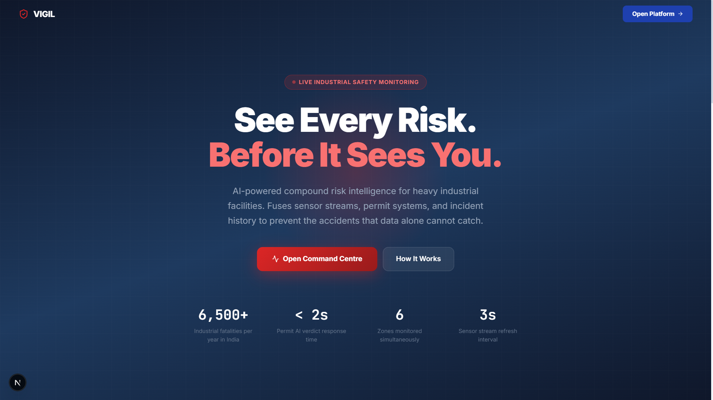
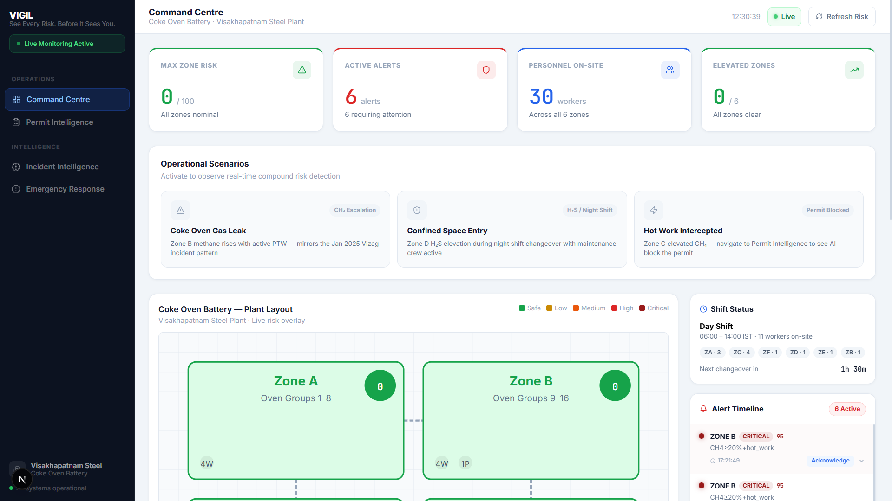
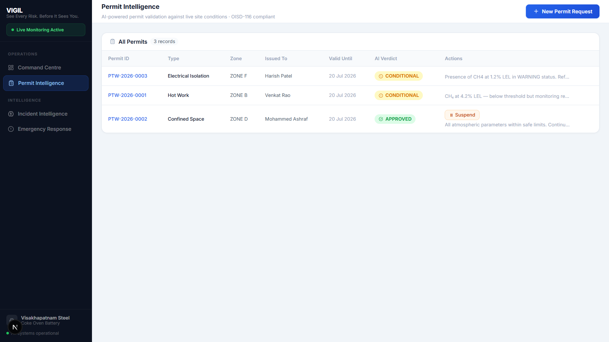
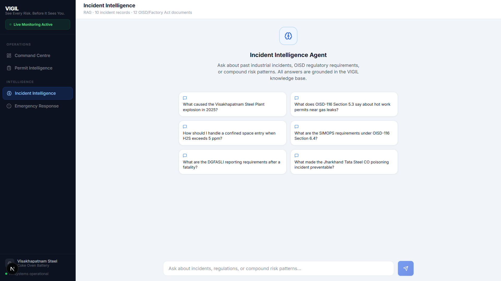
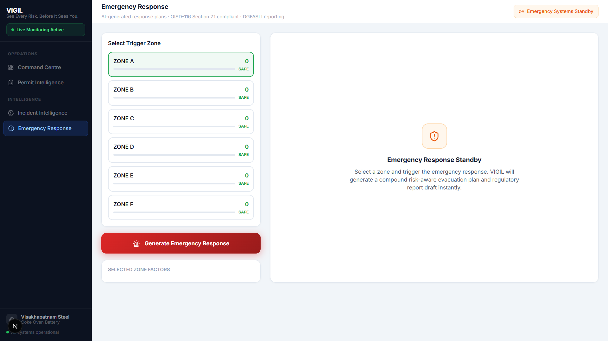
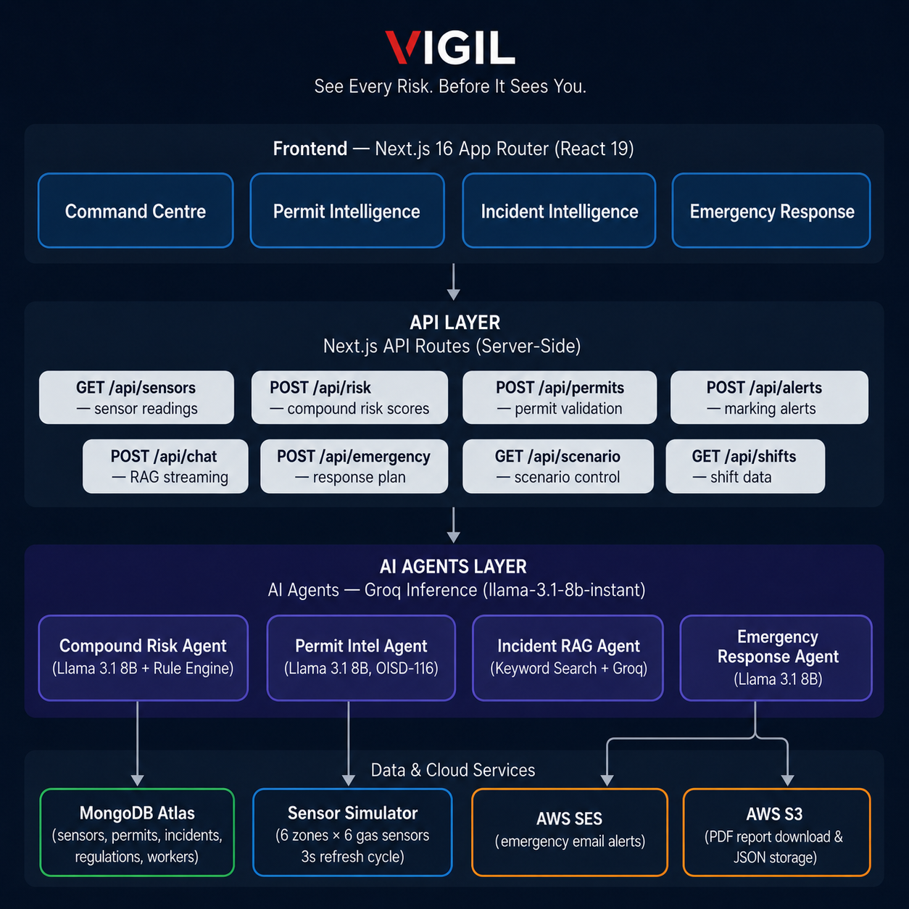

# ⚠️ VIGIL — Industrial Safety Intelligence Platform

> **See Every Risk. Before It Sees You.**

VIGIL is a real-time compound risk intelligence platform for heavy industrial facilities. It fuses live sensor streams, active work permits, shift context, and a decade of incident records to surface risks that individual data points alone cannot reveal — then acts on them.

Built for the **ET AI Hackathon 2.0**, VIGIL is anchored in a real event: the **January 2025 Visakhapatnam Steel Plant incident**, where data was present but unacted upon. 6,500+ industrial workers die annually in India. VIGIL is the intelligence layer that acts.

---

## The Problem

Traditional industrial safety systems generate alerts in silos:
- A gas sensor crosses a threshold → alert sent
- A hot-work permit is issued → recorded in a log
- A shift changeover happens → known only to supervisors

**None of these systems talk to each other.** VIGIL does.

---

## User Interface

- Landing Page
 
  

- Command Centre
 
  

- Permit Intelligence
 
  

- Incident Intelligence

  

- Emergency Response

  

---

## Four AI Agents. One Safety Layer.

| Agent | Function | Failure Mode It Solves |
|-------|----------|------------------------|
| **Compound Risk Agent** | Evaluates live sensor data + active permits + shift context using rule-based scoring + LLM reasoning (Llama 3.1 8B) | Siloed alerts that miss cross-variable risk |
| **Permit Intelligence Agent** | Validates work permits against live site conditions using OISD-116 + Factory Act 1948 | Permits issued without checking real-time gas levels |
| **Incident Intelligence Agent** | RAG over 10+ Indian industrial incidents + 12 OISD/Factory Act documents | Repeating past failures due to siloed incident data |
| **Emergency Response Agent** | Generates compound risk-aware evacuation plans + DGFASLI-compliant incident reports in seconds | Slow, manual emergency response under pressure |

---

## Architecture



---

## Features

### 📊 Command Centre (Dashboard)
- **Live sensor grid** — 6 zones × 6 sensors (CH₄, CO, H₂S, SO₂, Temperature, Gas Pressure) streaming every 3 seconds
- **Compound Risk Score** — AI evaluates cross-variable risk, not just threshold breaches
- **Operational Scenarios** — Instantly simulate Coke Oven Gas Leak, Confined Space Entry, or Hot Work Intercepted
- **Zone risk map** — Visual plant map with real-time risk levels
- **Shift status tracker** — Current shift, workers on site, changeover windows

### 📋 Permit Intelligence
- Submit work permits (Hot Work, Confined Space, Electrical, Cold Work)
- AI evaluates against **live sensor readings** in the requested zone
- Returns verdict: `APPROVED` / `CONDITIONAL` / `BLOCKED` with OISD section citation
- Detects SIMOPS conflicts (simultaneous operations — OISD-116 Section 6.4)
- Full permit history with status tracking

### 🧠 Incident Intelligence (RAG)
- Chat with VIGIL's knowledge base of 10+ real Indian industrial incidents
- Sources from OISD-116, Factory Act 1948, DGFASLI case studies
- Streaming responses with cited sources
- Ask about compound risk patterns, regulatory requirements, failure modes

### 🚨 Emergency Response
- Select any at-risk zone → AI generates a full evacuation plan in seconds
- Compound risk-aware: considers active permits, sensor levels, worker count
- OISD-116 Section 7.1 compliant response structure
- Auto-downloads PDF incident report
- PDF report download and JSON stored to AWS S3 with pre-signed URL
- Email alert via AWS SES with full report details

---

## Tech Stack

| Layer | Technology |
|-------|------------|
| Framework | Next.js 16 (App Router), React 19, TypeScript |
| AI / LLM | Groq API (`llama-3.1-8b-instant`), LangChain.js |
| Database | MongoDB Atlas (sensors, permits, incidents, regulations) |
| Cloud | AWS SES (email alerts), AWS S3 (JSON storage) |
| Styling | Vanilla CSS (custom design system) |
| PDF | jsPDF (client-side), PDFKit (server-side) |
| Streaming | Server-Sent Events (SSE) for live sensor data + RAG responses |
| Sensor Sim | Custom TypeScript simulator — 6 zones, 6 sensors, 3s cycle |
| Compliance | OISD-116, Factory Act 1948, DGFASLI standards |

---

## Project Structure

```
vigil/
├── app/
│   ├── page.tsx              # Landing page
│   ├── dashboard/page.tsx    # Command Centre
│   ├── permits/page.tsx      # Permit Intelligence
│   ├── intelligence/page.tsx # Incident Intelligence (RAG)
│   ├── emergency/page.tsx    # Emergency Response
│   └── api/
│       ├── sensors/          # Live sensor data
│       ├── risk/             # Compound risk scoring
│       ├── permits/          # Permit CRUD + AI validation
│       ├── chat/             # RAG streaming chat
│       ├── emergency/        # Emergency plan generation
│       ├── scenario/         # Demo scenario control
│       ├── alerts/           # Email alert dispatch
│       ├── shifts/           # Shift status
│       └── workers/          # Worker count
├── components/
│   ├── dashboard/            # SensorGauge, ScenarioControls, PlantMap, etc.
│   └── shared/               # Sidebar, navigation
├── lib/
│   ├── agents/
│   │   ├── compoundRisk.ts   # Risk scoring agent (rule-based + LLM)
│   │   ├── permitIntel.ts    # Permit validation agent
│   │   ├── incidentRAG.ts    # RAG query engine
│   │   └── emergencyResponse.ts
│   ├── aws/
│   │   ├── ses.ts            # Email alert dispatch
│   │   └── s3.ts             # JSON upload + presigned URLs
│   ├── db/mongodb.ts         # MongoDB Atlas connection
│   ├── simulation/
│   │   └── sensorSimulator.ts # Live sensor simulation engine
│   └── types/                # Shared TypeScript types
└── data/seed.ts              # Database seeder
```

---

## Setup & Running

### Prerequisites
- Node.js 18+
- MongoDB Atlas cluster
- Groq API key (free tier works — 131K TPM limit)
- AWS account (SES + S3, for email/PDF features)

### 1. Clone & Install

```bash
git clone https://github.com/Kritansh-Tank/vigil.git
cd vigil
npm install
```

### 2. Environment Variables

Create `.env.local` in the project root:

```env
# MongoDB
MONGODB_URI=mongodb+srv://<user>:<pass>@<cluster>.mongodb.net/vigil

# Groq (AI)
GROQ_API_KEY=gsk_...

# AWS (for email alerts and JSON storage)
AWS_REGION=ap-south-1
AWS_ACCESS_KEY_ID=...
AWS_SECRET_ACCESS_KEY=...
AWS_SES_FROM_EMAIL=alerts@yourdomain.com
AWS_S3_BUCKET=vigil-reports

# App
NEXT_PUBLIC_APP_URL=http://localhost:3000
```

### 3. Seed the Database

```bash
npm run seed
```

This populates:
- 10 industrial incident records (real events)
- 12 OISD-116 / Factory Act regulatory documents
- Initial sensor baseline readings
- Worker and shift data

### 4. Run

```bash
npm run dev
```

Open [http://localhost:3000](http://localhost:3000)

---

## Demo Scenarios

On the dashboard, use the **Operational Scenarios** panel to instantly simulate:

| Scenario | What It Does |
|----------|-------------|
| **Coke Oven Gas Leak** | Zone B methane rises with active PTW — mirrors the Jan 2025 Vizag incident pattern (CH₄ escalation) |
| **Confined Space Entry** | Zone D H₂S elevation during night shift changeover with maintenance crew active |
| **Hot Work Intercepted** | Zone C elevated CH₄ — navigate to Permit Intelligence to see AI block the permit |

---

## Demo Context

> **Anchor scenario:** January 2025 Visakhapatnam Steel Plant, India

A coke oven battery with 6 zones (A–F), monitoring:
- **CH₄** — Methane (% LEL) · Warn 10 · Danger 25
- **CO** — Carbon Monoxide (ppm) · Warn 25 · Danger 50
- **H₂S** — Hydrogen Sulphide (ppm) · Warn 5 · Danger 10
- **SO₂** — Sulphur Dioxide (ppm) · Warn 2 · Danger 5
- **TEMP** — Temperature (°C) · Warn 65 · Danger 85
- **PRESSURE** — Gas Pressure (kPa) · Warn 120 · Danger 150

Risk thresholds follow OISD-116 norms. Auto-emergency triggers when compound score exceeds 75, with a 5-minute cooldown per zone to prevent alert fatigue.

---

## Compliance References

- **OISD-116** — Oil Industry Safety Directorate standard for petroleum industry safety systems
- **Factories Act 1948** — Indian legislation governing occupational safety
- **DGFASLI** — Directorate General Factory Advice Service & Labour Institutes (incident reporting)

---

## License

MIT License - See [LICENSE](./LICENSE.md) file for details
